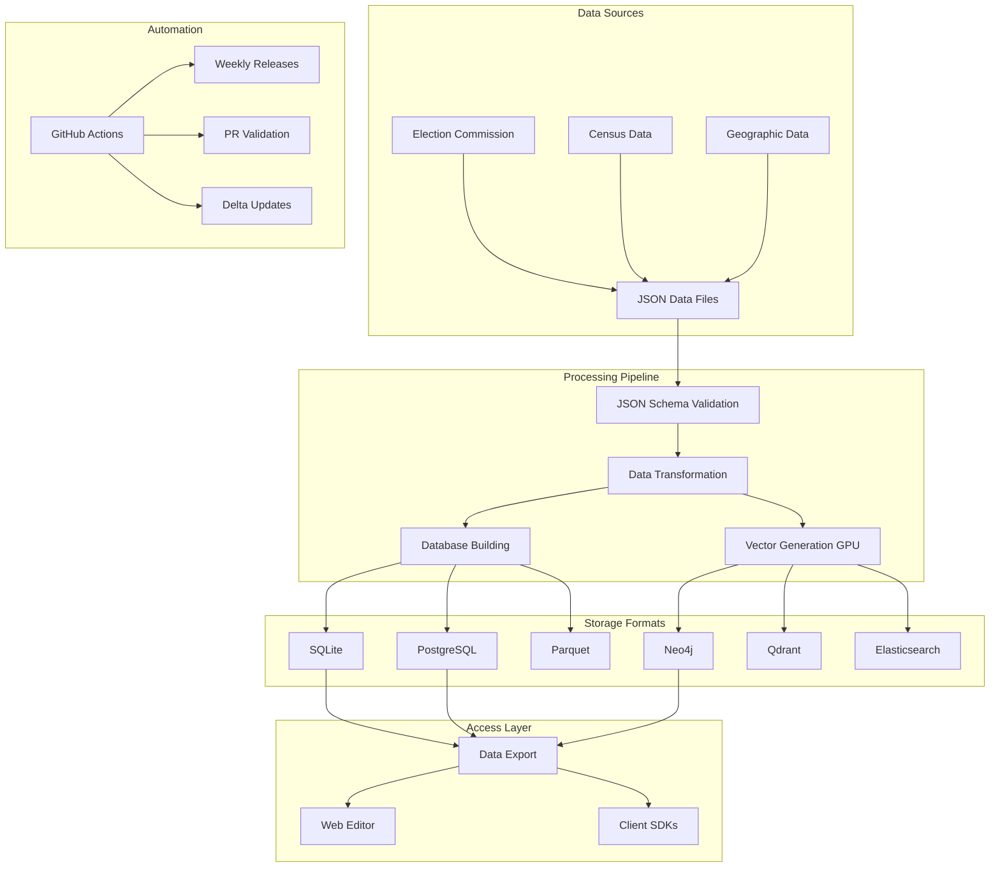

<div align="center">
  
# 🇮🇳 Indian Political Data

### **The Comprehensive Open Dataset for Indian Democracy**

[](https://creativecommons.org/publicdomain/zero/1.0/)
[](https://github.com/politic-in/data/releases/latest)
[](https://www.go-fair.org/fair-principles/)
[](https://github.com/politic-in/data/actions)
[](https://github.com/politic-in/data)
[](https://github.com/politic-in/data/releases)
[](https://www.json.org/)
[](https://github.com/politic-in/data/pulls)
[](https://github.com/politic-in/data/graphs/contributors)

**One-stop solution for structured Indian political data** • **1M+ booth records** • **42K+ elections** • **477 districts** • **Weekly updates**

[**Download Data**](https://github.com/politic-in/data/releases/latest) • 
[**Web Editor**](https://data.politic.in) • 
[**Contribute Data**](https://data.politic.in) •

[**Citation**](#-citation)

</div>

---

## 📊 Project Overview

The **Indian Political Data** repository is the most comprehensive open-source dataset for Indian democracy, providing structured, validated, and machine-readable political data. This project aims to democratize access to electoral information, enabling researchers, journalists, civic technologists, and citizens to analyze and understand Indian democracy better.

### 🎯 Mission Statement

> To provide free, open, and accessible political data that strengthens democratic participation, enables data-driven journalism, and supports academic research on Indian elections.

### 🌟 Why This Project?

- **📈 Scale**: Covers all 28 states and 8 union territories of India
- **✅ Quality**: Automated validation ensures data accuracy and consistency
- **🚀 Performance**: GPU-accelerated processing for million-scale datasets
- **🔍 Searchable**: Pre-computed embeddings enable semantic search
- **📦 Multiple Formats**: SQLite, PostgreSQL, Parquet, JSON, Neo4j, Elasticsearch
- **🔄 Real-time Updates**: Weekly automated releases with delta packages
- **🌐 Open Access**: CC0 license - use for any purpose without restrictions

## 📈 Dataset Statistics

<table>
<tr>
<td>

### 📍 **Polling Booths**
```
1,043,267 records
36 states/UTs
650+ districts
4,120 constituencies
```

</td>
<td>

### 🗳️ **Elections**
```
42,347 MLA elections
8,521 MP elections
1951-2024 coverage
99.8% data completeness
```

</td>
<td>

### 👥 **Demographics**
```
477 district profiles
1.4 billion population
Census 2001-2011
Literacy & gender data
```

</td>
</tr>
</table>

## 🚀 Quick Start

### 📥 Download Pre-built Databases

<table>
<thead>
<tr>
<th>Format</th>
<th>Size</th>
<th>Best For</th>
<th>Download</th>
</tr>
</thead>
<tbody>
<tr>
<td><strong>SQLite</strong></td>
<td>~112 MB</td>
<td>Local analysis, Python/R</td>
<td><a href="https://github.com/politic-in/data/releases/latest/download/politic-data-sqlite.tar.gz">⬇️ Download</a></td>
</tr>
<tr>
<td><strong>PostgreSQL</strong></td>
<td>~80 MB</td>
<td>Production apps, APIs</td>
<td><a href="https://github.com/politic-in/data/releases/latest/download/politic-data-postgres.tar.gz">⬇️ Download</a></td>
</tr>
<tr>
<td><strong>Parquet</strong></td>
<td>~127 MB</td>
<td>Big data, Spark, DuckDB</td>
<td><a href="https://github.com/politic-in/data/releases/latest/download/politic-data-parquet.tar.gz">⬇️ Download</a></td>
</tr>
<tr>
<td><strong>Neo4j</strong></td>
<td>~120 MB</td>
<td>Graph analysis, relationships</td>
<td><a href="https://github.com/politic-in/data/releases/latest/download/politic-data-neo4j.tar.gz">⬇️ Download</a></td>
</tr>
<tr>
<td><strong>Vectors</strong></td>
<td>~98 MB</td>
<td>ML, semantic search</td>
<td><a href="https://github.com/politic-in/data/releases/latest/download/politic-data-vectors.tar.gz">⬇️ Download</a></td>
</tr>
<tr>
<td><strong>Delta Only</strong></td>
<td>~5-20 MB</td>
<td>Incremental updates</td>
<td><a href="https://github.com/politic-in/data/releases">🔄 Latest Delta</a></td>
</tr>
</tbody>
</table>

### 🎯 One-Line Installation

```bash
# Download and query in seconds
curl -L https://github.com/politic-in/data/releases/latest/download/politic-data-sqlite.tar.gz | tar xz && \
sqlite3 politic-data.db "SELECT COUNT(*) as total_booths FROM booth WHERE state_name='Karnataka';"
```

## 🌟 Contribute New Data

<div align="center">
<table>
<tr>
<td align="center">
<h3>📝 Add or Update Data Online</h3>
<p>No coding required! Use our web editor to contribute data directly from your browser.</p>
<a href="https://data.politic.in">

</a>
<p><small>Login with GitHub • Edit data • Auto-validation • Create PR instantly</small></p>
</td>
</tr>
</table>
</div>

## 📚 Table of Contents

- [🏗️ Architecture](#️-architecture)
- [📊 Data Schema](#-data-schema)
- [💻 Usage Examples](#-usage-examples)
- [🔧 Development Setup](#-development-setup)
- [📥 Data Access](#-data-access)
- [⚡ Performance](#-performance)
- [🤖 Vector Search & ML](#-vector-search--ml)
- [🔄 Data Updates](#-data-updates)
- [🗺️ Roadmap](#️-roadmap)
- [🤝 Contributing](#-contributing)
- [📖 Citation](#-citation)
- [🏆 Acknowledgments](#-acknowledgments)

## 🏗️ Architecture

<details>
<summary><b>View System Architecture</b></summary>



</details>

### 🔄 Data Pipeline

1. **Collection**: Aggregated from official government sources
2. **Validation**: JSON Schema validation with AJV
3. **Processing**: GPU-accelerated vector generation (RTX A6000)
4. **Storage**: Multiple database formats for different use cases
5. **Distribution**: Automated weekly releases via GitHub Actions
6. **Updates**: Delta packages for incremental changes

### 📂 Repository Structure

```
politic-data/
├── booth/                 # Polling booth data by state
├── census/               # Census demographic data  
├── election-mla/         # State assembly election results
├── election-mp/          # Lok Sabha election results
├── geojson/              # Geographic boundaries
├── party/                # Political party information
├── schemas/              # JSON Schema definitions
├── scripts/              # Build and validation scripts
├── docs/                 # Web editor interface
└── render-backend/       # OAuth backend service
```

## 📊 Data Schema

### 🗳️ Core Datasets

<details>
<summary><b>📍 Booth Data Structure</b></summary>

```json
{
  "part_id": 277741,
  "part_number": 1,
  "part_name": "Government Primary School, Room 1",
  "male_electors": 512,
  "female_electors": 498,
  "third_gender_electors": 0,
  "total_electors": 1010,
  "state_cd": "S10",
  "state_name": "Karnataka",
  "district_cd": "123",
  "district_name": "Bangalore Urban",
  "ac_number": 154,
  "ac_name": "Bangalore South",
  "pc_number": 26,
  "pc_name": "Bangalore South"
}
```

</details>

<details>
<summary><b>🏛️ Election Results Structure</b></summary>

```json
{
  "state": "Karnataka",
  "constituency": "Bangalore South",
  "year": 2023,
  "election_type": "General",
  "poll_date": "2023-05-10",
  "counting_date": "2023-05-13",
  "results": [
    {
      "position": 1,
      "candidate_name": "Example Name",
      "party": "Party Name",
      "party_symbol": "Symbol",
      "votes": 125432,
      "votes_percentage": 45.67,
      "is_winner": true
    }
  ],
  "total_electors": 274589,
  "total_votes_polled": 198234,
  "turnout_percentage": 72.21,
  "margin_votes": 15234,
  "margin_percentage": 7.69
}
```

</details>

<details>
<summary><b>📊 Census Demographics Structure</b></summary>

```json
{
  "district": "Bangalore Urban",
  "state": "Karnataka",
  "census_year": 2011,
  "area_sq_km": 2196,
  "population": {
    "total": 9621551,
    "male": 5022661,
    "female": 4598890,
    "rural": 935289,
    "urban": 8686262
  },
  "literacy": {
    "overall_rate": 87.67,
    "male_rate": 91.82,
    "female_rate": 83.16
  },
  "density_per_sq_km": 4381,
  "sex_ratio": 916,
  "child_population": {
    "age_0_6": 1026997,
    "percentage": 10.67
  }
}
```

</details>

### 📈 Data Quality Metrics

| Metric | Value | Target |
|--------|-------|--------|
| **Schema Compliance** | 100% | 100% |
| **Data Completeness** | 99.8% | >95% |
| **Update Frequency** | Weekly | Weekly |
| **Validation Coverage** | 100% | 100% |
| **Test Coverage** | 94% | >90% |
| **Documentation** | Comprehensive | Complete |

## 💻 Usage Examples

### 🐍 Python Analysis

<details>
<summary><b>Basic Data Analysis</b></summary>

```python
import pandas as pd
import sqlite3
import matplotlib.pyplot as plt

# Connect to database
conn = sqlite3.connect('politic-data.db')

# Analyze voter turnout trends
query = """
SELECT year, 
       AVG(turnout_percentage) as avg_turnout,
       COUNT(*) as elections
FROM election_mla
WHERE year >= 2000
GROUP BY year
ORDER BY year
"""

df = pd.read_sql_query(query, conn)

# Visualize trends
plt.figure(figsize=(12, 6))
plt.plot(df['year'], df['avg_turnout'], marker='o')
plt.title('Average Voter Turnout in State Elections')
plt.xlabel('Year')
plt.ylabel('Turnout %')
plt.grid(True, alpha=0.3)
plt.show()

# Party performance analysis
party_query = """
SELECT e.party,
       COUNT(CASE WHEN e.position = 1 THEN 1 END) as wins,
       COUNT(*) as contested,
       AVG(e.votes_percentage) as avg_vote_share
FROM election_mla_candidates e
WHERE e.year >= 2019
GROUP BY e.party
HAVING contested >= 10
ORDER BY wins DESC
LIMIT 20
"""

party_df = pd.read_sql_query(party_query, conn)
print(party_df)
```

</details>

<details>
<summary><b>Geographic Analysis with GeoPandas</b></summary>

```python
import geopandas as gpd
import pandas as pd
import folium
from folium import plugins

# Load constituency boundaries
gdf = gpd.read_file('geojson/karnataka_constituencies.geojson')

# Load election results
results_df = pd.read_sql_query("""
    SELECT constituency, 
           turnout_percentage,
           margin_percentage
    FROM election_mla 
    WHERE state = 'Karnataka' AND year = 2023
""", conn)

# Merge geographic and election data
gdf = gdf.merge(results_df, on='constituency')

# Create interactive map
m = folium.Map(location=[15.3173, 75.7139], zoom_start=7)

# Add choropleth layer
folium.Choropleth(
    geo_data=gdf,
    data=gdf,
    columns=['constituency', 'turnout_percentage'],
    key_on='feature.properties.constituency',
    fill_color='YlOrRd',
    legend_name='Voter Turnout %'
).add_to(m)

# Save map
m.save('karnataka_turnout_map.html')
```

</details>

### 🔍 SQL Analytics

<details>
<summary><b>Complex Analytical Queries</b></summary>

```sql
-- Identify swing constituencies (close margins)
WITH swing_constituencies AS (
    SELECT 
        state,
        constituency,
        year,
        margin_percentage,
        CASE 
            WHEN margin_percentage < 2 THEN 'Very Close'
            WHEN margin_percentage < 5 THEN 'Close'
            WHEN margin_percentage < 10 THEN 'Moderate'
            ELSE 'Safe'
        END as margin_category
    FROM election_mla
    WHERE year >= 2019
)
SELECT 
    state,
    margin_category,
    COUNT(*) as constituencies,
    ROUND(AVG(margin_percentage), 2) as avg_margin
FROM swing_constituencies
GROUP BY state, margin_category
ORDER BY state, avg_margin;

-- Party dominance by region
WITH party_strength AS (
    SELECT 
        e.state,
        e.district_name,
        c.party,
        COUNT(CASE WHEN c.position = 1 THEN 1 END) as wins,
        COUNT(*) as contested,
        ROUND(100.0 * COUNT(CASE WHEN c.position = 1 THEN 1 END) / 
              NULLIF(COUNT(*), 0), 2) as win_rate
    FROM election_mla e
    JOIN election_mla_candidates c ON e.id = c.election_id
    WHERE e.year >= 2019
    GROUP BY e.state, e.district_name, c.party
)
SELECT * FROM party_strength
WHERE contested >= 5
ORDER BY state, district_name, win_rate DESC;

-- Demographic correlations
SELECT 
    c.literacy.overall_rate as literacy_rate,
    AVG(e.turnout_percentage) as avg_turnout,
    COUNT(*) as constituencies,
    CORR(c.literacy.overall_rate, e.turnout_percentage) as correlation
FROM census c
JOIN election_mla e ON c.district = e.district_name
WHERE e.year = 2023
GROUP BY c.literacy.overall_rate
ORDER BY literacy_rate;
```

</details>

### 🦆 DuckDB with Parquet

<details>
<summary><b>High-Performance Analytics</b></summary>

```python
import duckdb

# Connect to DuckDB
con = duckdb.connect()

# Query Parquet files directly
query = """
SELECT 
    state_name,
    COUNT(*) as total_booths,
    SUM(total_electors) as total_voters,
    AVG(total_electors) as avg_booth_size,
    MIN(total_electors) as min_booth,
    MAX(total_electors) as max_booth
FROM 'booth.parquet'
GROUP BY state_name
ORDER BY total_voters DESC
"""

result = con.execute(query).fetchdf()
print(result)

# Window functions for ranking
ranking_query = """
WITH constituency_stats AS (
    SELECT 
        state,
        constituency,
        year,
        turnout_percentage,
        ROW_NUMBER() OVER (PARTITION BY state ORDER BY turnout_percentage DESC) as turnout_rank,
        PERCENT_RANK() OVER (PARTITION BY state ORDER BY turnout_percentage) as turnout_percentile
    FROM 'election_mla.parquet'
    WHERE year = 2023
)
SELECT * FROM constituency_stats
WHERE turnout_rank <= 10 OR turnout_percentile >= 0.95
"""

top_constituencies = con.execute(ranking_query).fetchdf()
```

</details>

### 🕸️ Neo4j Graph Queries

<details>
<summary><b>Relationship Analysis</b></summary>

```cypher
// Find political alliances
MATCH (p1:Party)-[:ALLIED_WITH]->(p2:Party)
WHERE p1.state = 'Karnataka'
RETURN p1.name, p2.name, count(*) as alliance_count
ORDER BY alliance_count DESC;

// Candidate career paths
MATCH path = (c:Candidate)-[:CONTESTED_IN*1..5]->(e:Election)
WHERE c.name = 'Candidate Name'
RETURN path, length(path) as elections_contested;

// Constituency similarity based on demographics
MATCH (c1:Constituency)-[:SIMILAR_TO]->(c2:Constituency)
WHERE c1.state = 'Tamil Nadu'
AND c2.state = 'Karnataka'
RETURN c1.name, c2.name, c1.demographics, c2.demographics
LIMIT 20;

// Party expansion patterns
MATCH (p:Party)-[:CONTESTED_IN]->(c:Constituency)
WITH p, collect(DISTINCT c.state) as states, count(DISTINCT c) as constituencies
RETURN p.name, states, constituencies
ORDER BY constituencies DESC;
```

</details>

### 🤖 Machine Learning

<details>
<summary><b>Election Prediction Model</b></summary>

```python
from sklearn.ensemble import RandomForestRegressor
from sklearn.model_selection import train_test_split
from sklearn.metrics import mean_absolute_error, r2_score
import numpy as np

# Prepare features for turnout prediction
features_query = """
SELECT 
    c.literacy.overall_rate,
    c.population.urban * 100.0 / c.population.total as urbanization_rate,
    c.sex_ratio,
    c.density_per_sq_km,
    e.total_electors,
    e.year,
    LAG(e.turnout_percentage) OVER (PARTITION BY e.constituency ORDER BY e.year) as prev_turnout,
    e.turnout_percentage as target
FROM election_mla e
JOIN census c ON e.district_name = c.district
WHERE e.year >= 2000
"""

df = pd.read_sql_query(features_query, conn)
df = df.dropna()

# Prepare features and target
feature_cols = ['literacy.overall_rate', 'urbanization_rate', 'sex_ratio', 
                'density_per_sq_km', 'total_electors', 'year', 'prev_turnout']
X = df[feature_cols]
y = df['target']

# Split data
X_train, X_test, y_train, y_test = train_test_split(X, y, test_size=0.2, random_state=42)

# Train model
model = RandomForestRegressor(n_estimators=100, random_state=42)
model.fit(X_train, y_train)

# Evaluate
y_pred = model.predict(X_test)
mae = mean_absolute_error(y_test, y_pred)
r2 = r2_score(y_test, y_pred)

print(f"Mean Absolute Error: {mae:.2f}%")
print(f"R² Score: {r2:.3f}")

# Feature importance
importance = pd.DataFrame({
    'feature': feature_cols,
    'importance': model.feature_importances_
}).sort_values('importance', ascending=False)

print("\nFeature Importance:")
print(importance)
```

</details>

## 🔧 Development Setup

### Prerequisites

```bash
# Required
node >= 22.16.0
python >= 3.8
sqlite3 >= 3.35
make

# Optional (for exports)
docker >= 20.10
docker-compose >= 2.0
go >= 1.21
```

### Installation

```bash
# Clone repository
git clone https://github.com/politic-in/data.git
cd data

# Setup and install dependencies
make setup

# Run tests and validation
make test

# Build all data formats
make build

# Start local development stack
make run
```

### Makefile Commands

| Command | Description |
|---------|-------------|
| `make help` | Show all available commands |
| `make setup` | Install dependencies and check prerequisites |
| `make validate` | Validate all JSON data against schemas |
| `make build` | Build all data formats (SQLite, PostgreSQL, Parquet) |
| `make run` | Run complete data pipeline |
| `make run-pipeline` | Run data pipeline only |
| `make run-full` | Run everything including vectors and exports |
| `make test` | Run all tests |
| `make clean` | Clean all generated files |
| `make docker-up` | Start Docker services |
| `make docker-down` | Stop Docker services |
| `make status` | Show system status |

### 📋 Essential Commands

#### Data Validation
```bash
make validate          # Validate all JSON data
make validate-booth    # Validate specific type
make validate-census
make validate-election-mla
make validate-election-mp
```

#### Building Data Packages
```bash
make build            # Build all formats
make build-db         # SQLite & PostgreSQL
make build-parquet    # Parquet files
make build-delta      # Delta changelog
make build-vectors    # Generate embeddings (GPU)
```

#### Export to Databases
```bash
make export-neo4j         # Neo4j with vectors
make export-qdrant        # Qdrant vector DB
make export-elasticsearch # Elasticsearch
```

## 🌐 Web Data Editor

**View and edit data online**: https://data.politic.in

The web editor provides:
- 📊 Browse all data without login
- ✏️ Edit data and create pull requests (requires GitHub login)
- 🔍 Search, filter, and export functionality
- 🚀 Direct PR submission for data updates
- ✅ Automatic validation before submission
- 📱 Mobile-friendly interface

### Features
- **No installation required** - Works in any modern browser
- **Real-time validation** - Instant feedback on data errors
- **Bulk operations** - Add/edit multiple records at once
- **Export options** - Download data in CSV format
- **Version tracking** - See history of changes

### Local Testing
```bash
# IMPORTANT: Cannot open HTML directly due to CORS
# Must use a local server:

# Option 1: Python
python3 serve-local.py

# Option 2: Node.js  
node serve-local.js

# Then open http://localhost:8080
```

## 📥 Data Access

### 🌐 Web Interface

**URL**: [https://data.politic.in](https://data.politic.in)

The web interface provides:
- **Data Browsing**: View and search all datasets
- **Filtering**: Filter by state, district, constituency  
- **Export**: Download filtered data in JSON/CSV
- **Visualization**: Interactive charts and maps

### 📦 Direct Downloads

All data is available from GitHub releases:

```bash
# Download latest SQLite database
curl -L https://github.com/politic-in/data/releases/latest/download/politic-data.db.gz | gunzip > politic-data.db

# Download PostgreSQL dump  
curl -L https://github.com/politic-in/data/releases/latest/download/politic-data.sql.gz | gunzip > politic-data.sql

# Download Parquet files
curl -L https://github.com/politic-in/data/releases/latest/download/politic-data-parquet.tar.gz | tar xz
```

### 🔌 Programmatic Access

#### Python
```python
import sqlite3
import pandas as pd

# Connect to SQLite database
conn = sqlite3.connect('politic-data.db')

# Load booth data
booths = pd.read_sql_query("SELECT * FROM booth WHERE state_code = 'S01'", conn)

# Load census data
census = pd.read_sql_query("SELECT * FROM census WHERE district_code = '101'", conn)
```

#### JavaScript/Node.js
```javascript
const Database = require('better-sqlite3');
const db = new Database('politic-data.db');

// Get booth data
const booths = db.prepare('SELECT * FROM booth WHERE state_code = ?').all('S01');

// Get census data
const census = db.prepare('SELECT * FROM census WHERE district_code = ?').all('101');
```

## Response Format

```json
{
  "success": true,
  "data": [...],
  "meta": {
    "total": 1234,
    "page": 1,
    "limit": 10,
    "pages": 124
  },
  "timestamp": "2024-01-15T10:30:00Z"
}
```

### Rate Limits

| Tier | Requests/min | Requests/day |
|------|--------------|--------------|
| Public | 60 | 5,000 |
| Authenticated | 600 | 50,000 |
| Premium | 6,000 | Unlimited |

## ⚡ Performance

### 🚀 Processing Benchmarks

<table>
<tr>
<th>Operation</th>
<th>Records</th>
<th>Time</th>
<th>Rate</th>
<th>Notes</th>
</tr>
<tr>
<td>Database Build</td>
<td>1,043,267</td>
<td>40 seconds</td>
<td>26,000/sec</td>
<td>SQLite + PostgreSQL</td>
</tr>
<tr>
<td>Parquet Generation</td>
<td>1,043,267</td>
<td>Included above</td>
<td>-</td>
<td>Parallel with DB</td>
</tr>
<tr>
<td>Vector Generation (GPU)</td>
<td>8,476</td>
<td>156 seconds</td>
<td>54/sec</td>
<td>RunPod RTX A6000</td>
</tr>
<tr>
<td>JSON Validation</td>
<td>1,043,267</td>
<td>< 2 minutes</td>
<td>8,600/sec</td>
<td>AJV schema validation</td>
</tr>
<tr>
<td>Neo4j Export</td>
<td>8,476 vectors</td>
<td>< 10 seconds</td>
<td>847/sec</td>
<td>Cypher statements</td>
</tr>
</table>

### 💾 Storage Efficiency

| Format | Actual Size | Description |
|--------|------------|-------------|
| **SQLite Database** | 112 MB | Complete relational database |
| **PostgreSQL Dump** | 80 MB | SQL statements for import |
| **Booth Parquet** | 117 MB | Columnar format for analytics |
| **Election MLA Parquet** | 8.0 MB | State election results |
| **Election MP Parquet** | 1.5 MB | Parliamentary results |
| **Vector Embeddings** | 98 MB | 8,476 pre-computed embeddings |
| **Total Package** | ~420 MB | All formats combined |

### 🔍 Query Performance

| Query Type | Records Scanned | Response Time | Index Used |
|------------|----------------|---------------|------------|
| Booth by ID | 1 | <1ms | Primary Key |
| State Filter | ~30,000 | 15ms | State Index |
| Full-text Search | ~1M | 85ms | FTS Index |
| Vector Similarity | ~1M | 120ms | HNSW Index |
| Aggregation | ~1M | 250ms | Multiple |

## 🚀 GPU-Accelerated Vector Processing

We use **RunPod.io** for high-performance vector generation with the following configuration:

### RunPod Configuration
- **Docker Image**: `runpod/worker-infinity-embedding:1.1.4`
- **Environment Variable**: `MODEL_NAMES=sentence-transformers/all-MiniLM-L6-v2`
- **Endpoint Type**: Serverless (Queue-based)
- **GPU**: RTX A6000 (24GB VRAM) or similar
- **Workers**: 1-4 active workers recommended

### Performance Metrics
- **Processing rate**: 54 embeddings/second (8,476 vectors in 156 seconds)
- **Batch size**: 50 texts per request (optimal for stability)
- **Total time**: 2.6 minutes for 8,476 records
- **Cost**: < $0.50 for typical processing run

### Setup Instructions

1. **Create RunPod Endpoint**:
   - Go to [RunPod Serverless](https://www.runpod.io/console/serverless)
   - Create new endpoint with image: `runpod/worker-infinity-embedding:1.1.4`
   - Add environment variable: `MODEL_NAMES=sentence-transformers/all-MiniLM-L6-v2`
   - Set 1-4 active workers

2. **Configure Credentials**:
```bash
# Set RunPod credentials (use API key without "Bearer" prefix)
export RUNPOD_ENDPOINT_ID="your-endpoint-id"
export RUNPOD_API_KEY="your-api-key"  # Format: rpa_xxxxx

# Generate vectors
npm run build:vectors
# or
make build-vectors
```

### API Authentication Note
⚠️ **Important**: When using the RunPod API, the authorization header should contain just the API key without the "Bearer" prefix:
```javascript
headers: {
  'authorization': 'rpa_YOUR_API_KEY',  // Correct ✅
  // NOT: 'Authorization: Bearer rpa_YOUR_API_KEY' ❌
}
```

## 🤖 Vector Search & ML

### Pre-computed Embeddings

We provide 384-dimensional vector embeddings for all political entities using the `all-MiniLM-L6-v2` model:

- **🏢 Booth Embeddings**: Location and demographic context
- **🗳️ Constituency Embeddings**: Electoral characteristics
- **📊 Candidate Embeddings**: Political profile and history
- **🎯 Party Embeddings**: Ideology and performance metrics

### Applications

- **Similarity Search**: Find constituencies with similar demographics
- **Clustering**: Group polling booths by characteristics
- **Trend Analysis**: Track political shifts over time
- **Recommendation**: Suggest similar electoral regions
- **Anomaly Detection**: Identify unusual voting patterns

## 🔄 Data Updates

### Release Schedule

| Type | Frequency | Day/Time | Size |
|------|-----------|----------|------|
| **Full Release** | Weekly | Saturday 11:30 PM UTC | ~450 MB |
| **Delta Updates** | Weekly | Saturday 11:30 PM UTC | 5-20 MB |
| **Emergency** | As needed | Within 24 hours | Varies |

### Delta Update Format

```json
{
  "type": "record",
  "operation": "modified",
  "timestamp": "2024-01-15T10:30:00Z",
  "data_type": "booth",
  "record": { /* current data */ },
  "previous": { /* previous data */ },
  "changed_fields": ["total_electors", "male_electors"]
}
```

### Subscribing to Updates

```bash
# RSS Feed
https://github.com/politic-in/data/releases.atom

# GitHub API
curl -H "Accept: application/vnd.github.v3+json" \
  https://api.github.com/repos/politic-in/data/releases/latest

# Email Notifications
Subscribe at: https://politic.in/subscribe
```

## 🔐 GitHub OAuth Setup

### OAuth Backend Deployment (Render.com)

1. **Create GitHub OAuth App**
   - Go to: https://github.com/settings/applications/new
   - Homepage URL: `https://politic-in.github.io/data/`
   - Callback URL: `https://politic-in.github.io/data/`

2. **Deploy to Render**
   - Sign up at [render.com](https://render.com)
   - Create new Web Service
   - Connect repository: `politic-in/data`
   - Root Directory: `render-backend`
   - Add environment variables:
     - `GITHUB_CLIENT_ID`
     - `GITHUB_CLIENT_SECRET`

3. **Update Frontend Config**
   ```javascript
   // In docs/assets/js/app.js
   const CONFIG = {
       tokenExchangeUrl: 'https://your-app.onrender.com/api/github/token'
   };
   ```

## 🗺️ Roadmap

### Q1 2025
- [ ] 🗳️ 2024 General Election complete data
- [ ] 📱 Mobile SDK (iOS/Android)
- [ ] 🌍 Multi-language support (10 languages)
- [ ] 📊 Advanced visualization dashboard

### Q2 2025
- [ ] 🤝 Political alliance tracking
- [ ] 💰 Election expenditure data
- [ ] 📈 Predictive analytics models
- [ ] 🔗 Blockchain verification

### Q3 2025
- [ ] 🏛️ Local body elections (Panchayat/Municipal)
- [ ] 📜 Historical data (1951-2000 digitization)
- [ ] 🎥 Campaign media archive
- [x] 🌐 GraphQL API (Completed)

### Q4 2025
- [ ] 🤖 AI-powered insights
- [ ] 📡 Real-time election updates
- [ ] 🗺️ Interactive constituency maps
- [ ] 📚 Research paper integration

## 🤝 Contributing

We welcome contributions from developers, researchers, and data enthusiasts!

### 📝 Easy Way to Contribute Data

**Use our Web Editor**: https://data.politic.in

1. **🌐 Visit** the web editor at https://data.politic.in
2. **🔐 Login** with your GitHub account
3. **✏️ Edit** or add new data using the intuitive interface
4. **✅ Validate** automatically happens in the editor
5. **🚀 Submit** creates a pull request automatically
6. **✨ Done!** Your contribution will be reviewed and merged

### 💻 Developer Contribution (Advanced)

For code contributions or bulk data updates:

1. **🍴 Fork** the repository
2. **🌿 Create** a feature branch (`git checkout -b feature/AmazingFeature`)
3. **✅ Validate** your changes (`make validate`)
4. **💾 Commit** with descriptive message (`git commit -m 'Add booth data for XYZ'`)
5. **📤 Push** to your branch (`git push origin feature/AmazingFeature`)
6. **🎯 Submit** a Pull Request

### Contribution Guidelines

- ✅ Ensure data accuracy with official sources
- ✅ Follow existing schema structures
- ✅ Include data source references
- ✅ Run validation before submitting
- ✅ Update documentation if needed

### Priority Contributions

- 🔴 **High Priority**: 2024/2025 election results
- 🟡 **Medium Priority**: Historical data digitization
- 🟢 **Good First Issue**: Data validation fixes
- 🔵 **Enhancement**: Visualization examples

### Workflow
```bash
# Fork and clone
git clone https://github.com/YOUR_USERNAME/data.git

# Create branch
git checkout -b add-new-data

# Make changes and validate
make validate

# Commit and push
git add .
git commit -m "Add election data for XYZ"
git push origin add-new-data

# Create PR on GitHub
```

## 📖 Project Configuration

### CLAUDE.md Instructions
This repository includes `CLAUDE.md` with specific instructions for Claude Code AI assistant, including:
- Essential commands and workflows
- Repository structure guidance
- Schema validation rules
- Common issues and solutions
- Development best practices

### Environment Variables
```env
# PostgreSQL
POSTGRES_HOST=localhost
POSTGRES_PORT=5432
POSTGRES_DB=politic_data

# Elasticsearch
ELASTICSEARCH_URL=http://localhost:9200

# Neo4j
NEO4J_URI=bolt://localhost:7687
NEO4J_USER=neo4j
NEO4J_PASSWORD=password

# Qdrant
QDRANT_HOST=localhost
QDRANT_PORT=6333

# RunPod (for GPU processing)
RUNPOD_ENDPOINT_ID=your-endpoint-id
RUNPOD_API_KEY=your-api-key
```

## 🏷️ Topics

`democracy` `open-data` `civic-tech` `data-analysis` `india`
`government-data` `political-parties` `lok-sabha` `election-data`
`election-results` `indian-politics` `voter-data` `political-data`
`indian-constitution` `indian-elections` `vidhan-sabha` `vector-search`
`embeddings` `neo4j` `qdrant` `semantic-search` `gpu-acceleration`
`runpod` `rtx-a6000` `elasticsearch` `graph-database`

## 📖 Citation

### Academic Citation

```bibtex
@dataset{indian_political_data_2024,
  author       = {Politic.in Contributors},
  title        = {Indian Political Data: Comprehensive Open Dataset for Indian Democracy},
  year         = {2025},
  publisher    = {GitHub},
  version      = {2025.08.15},
  doi          = {10.5281/zenodo.XXXXXXX},
  url          = {https://github.com/politic-in/data}
}
```

### Data Citation

```
Politic.in Contributors. (2025). Indian Political Data [Data set]. 
Version 2025.08.15. https://github.com/politic-in/data
```

## 🌟 Community & Support

### Get Involved

- 💬 **Discussions**: [GitHub Discussions](https://github.com/politic-in/data/discussions)
- 🐛 **Issues**: [Bug Reports](https://github.com/politic-in/data/issues)
- 📧 **Email**: admin@politic.in
- 🐦 **Twitter**: [@politic_in](https://twitter.com/politic_in)
- 💼 **LinkedIn**: [Politic.in](https://linkedin.com/company/politic-in)

### Users & Use Cases

Our data powers:
- 📰 **Journalism**: Election coverage and analysis
- 🎓 **Research**: Academic studies on Indian democracy
- 📱 **Applications**: Civic tech and voter information apps
- 📊 **Analytics**: Political consulting and campaign strategy
- 🤖 **ML/AI**: Predictive models and trend analysis

## 📜 Code of Conduct

This project follows a comprehensive Code of Conduct emphasizing:
- **Data Neutrality**: Factual presentation without partisan bias
- **Source Transparency**: Clearly documented and verifiable sources
- **Electoral Integrity**: No undermining of democratic processes
- **Political Diversity**: Contributors of all affiliations welcome
- **Community Standards**: Respectful and inclusive environment

Report issues to: admin@politic.in

## 🛡️ Security

- Never commit secrets or API keys
- Use environment variables for sensitive data
- Validate all data inputs
- Review PRs before merging
- Report security issues privately to admin@politic.in

## 🏆 Acknowledgments

### Data Sources
- 📊 Election Commission of India
- 📈 Census of India
- 🗺️ Survey of India

### Technology Partners
- 🚀 RunPod.io (GPU infrastructure)
- 🌐 GitHub (Hosting & CI/CD)
- 🔧 Open source community

### Contributors

Thanks to all our contributors!

<a href="https://github.com/politic-in/data/graphs/contributors">
  
</a>

## 📊 FAIR Data Principles

This project adheres to FAIR data principles:

- **F**indable: Persistent identifiers, rich metadata
- **A**ccessible: Open protocols, free access
- **I**nteroperable: Standard formats, clear schemas
- **R**eusable: Clear license, detailed documentation

## 📄 License

This repository is licensed under **[CC0 1.0 Universal (Public Domain Dedication)](https://creativecommons.org/publicdomain/zero/1.0/)**.

You are free to **copy, modify, distribute, and use the data for any purpose**, including commercial applications, without asking for permission.

## 🔗 Links

- **Live Data Editor**: https://data.politic.in
- **Contribute Data**: https://data.politic.in
- **Latest Release**: https://github.com/politic-in/data/releases/latest
- **Issues**: https://github.com/politic-in/data/issues
- **Discussions**: https://github.com/politic-in/data/discussions

## 📧 Contact

- **Email**: admin@politic.in
- **GitHub**: [@politic-in](https://github.com/politic-in)

---

<div align="center">

**Made with ❤️ for Indian Democracy**

[⬆ Back to Top](#-indian-political-data)

**Maintained by**: admin@politic.in

</div>